# React_Native_Practicas

Practicas de creación de apps en React Native, algunas con consumo de APIs

## Proyectos

# U3-6_SeguimientoEnvios
Aplicación para seguimiento de pedidos. Administradir y usuario. La navegación es mediante Bottom Tab Navigation. Uso de splash screen.

  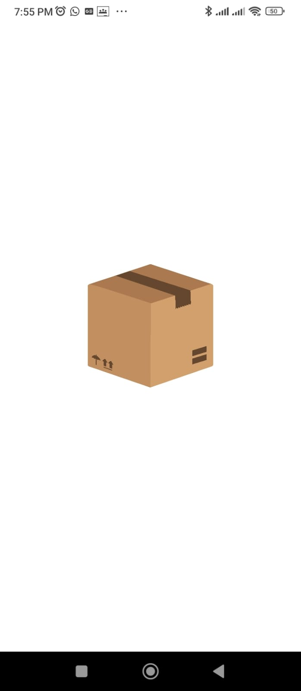
  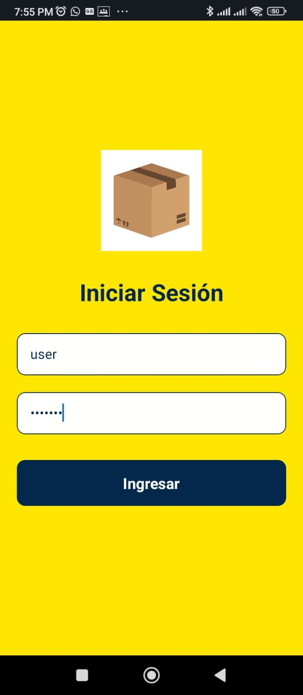
  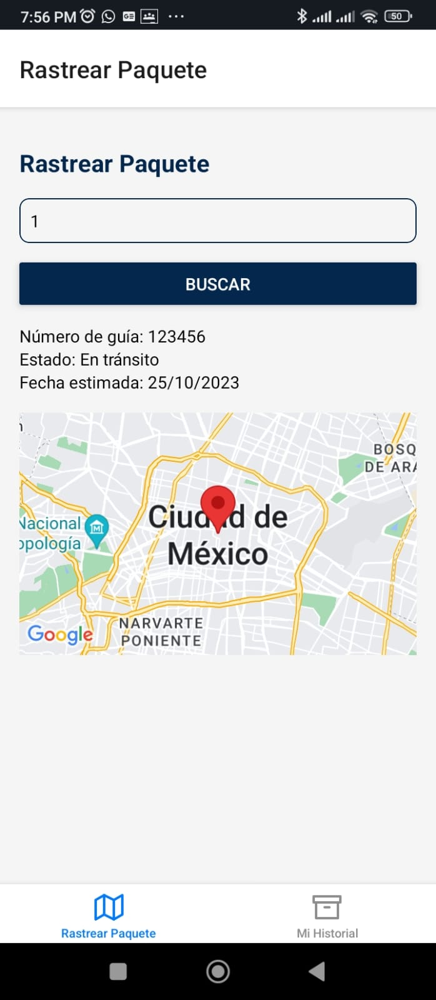
  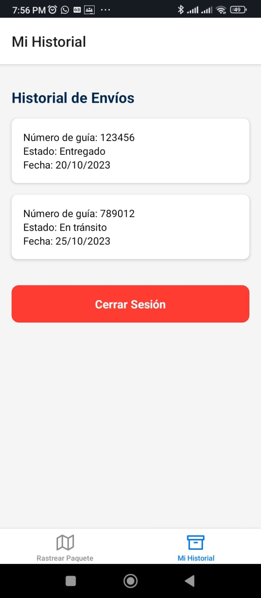
  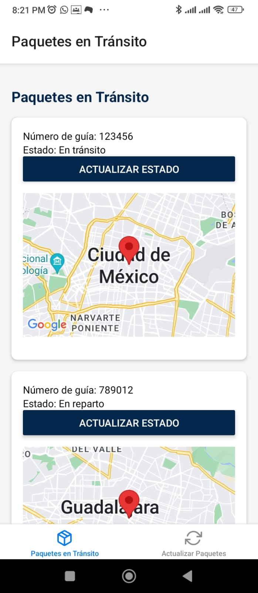
  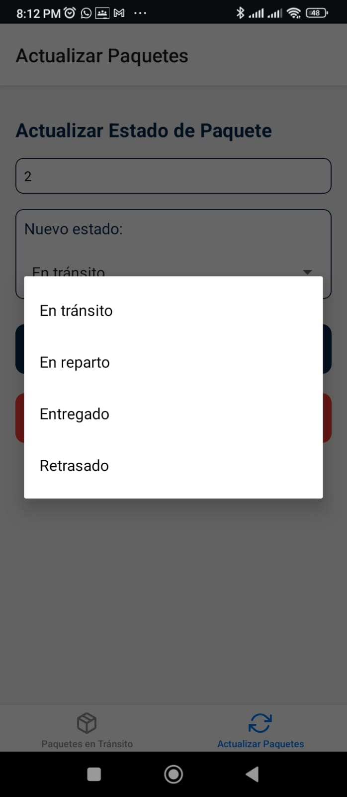

# U3-5_AplicacionPedidos

Aplicación de Pedidos de Comida con 2 usuarios: cliente y repartidor. Este proyecto solo es Maquetación. La navegación es mediante Bottom Tab Navigation. Uso de splash screen.

  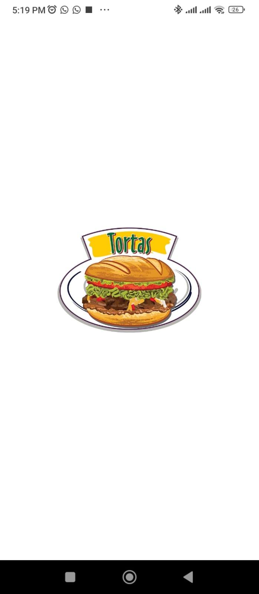
  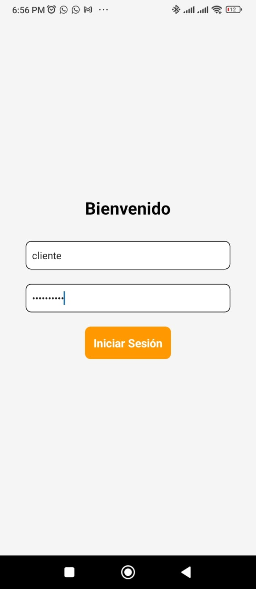
  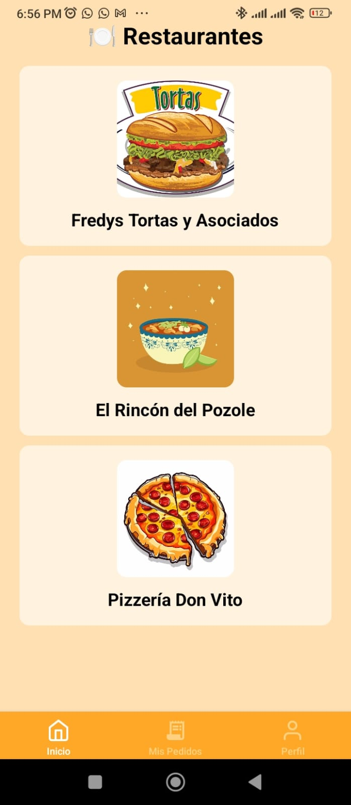
  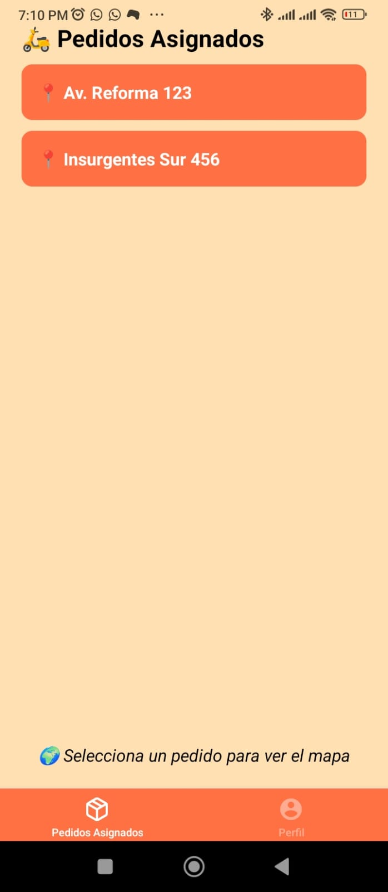
  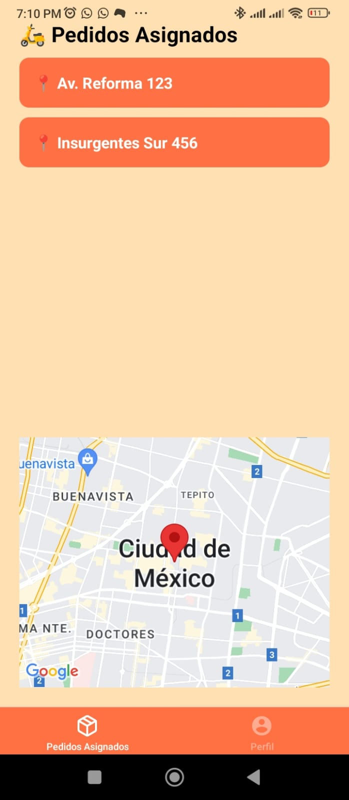
  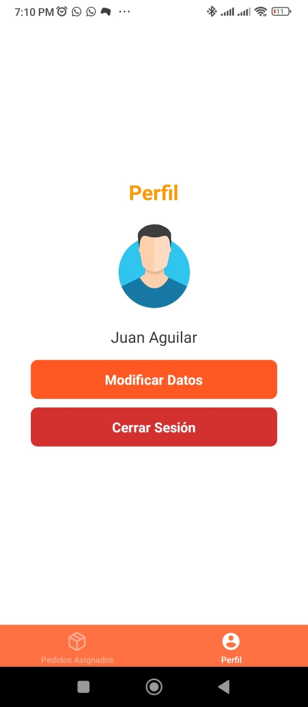

